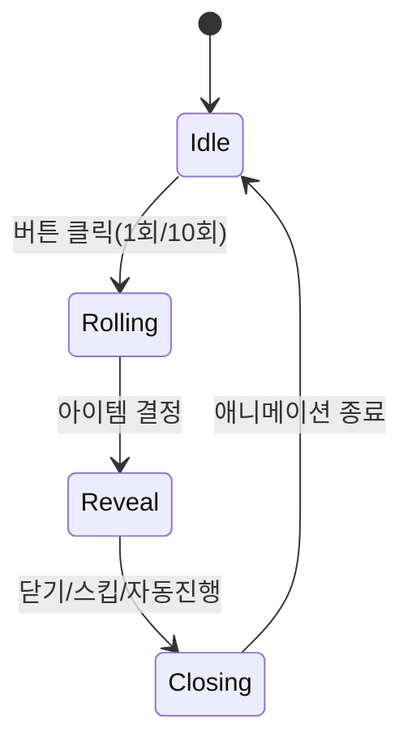

# 🎰 CatchU – Gacha Reward Popup UI

Unity 2022.3.x 기반의 **뽑기(가챠) 팝업 UI** 구현 과제입니다.  
버튼 클릭 → 아이템 추첨 → 자연스러운 팝업 등장/종료, 등급별 연출, 스킵/10연 지원까지 구현했습니다.

---

## 📑 상태 다이어그램



- **Idle** : 대기 상태(버튼 입력 가능)
- **Rolling** : 추첨 중(중복 클릭 차단)
- **Reveal** : 팝업 UI 애니메이션/데이터 노출
- **Closing** : 닫기 애니메이션 → 다시 Idle

---

## 🗂️ 프리팹/스크립트 구조

```
Assets/CatchU/
 ├── Scripts/
 │   ├── Rarity.cs                // 등급 Enum
 │   ├── ItemDefinition.cs        // 아이템 데이터 SO
 │   ├── RarityStyle.cs           // 등급별 스타일 SO
 │   ├── GachaStateMachine.cs     // Idle/Rolling/Reveal/Closing 관리
 │   ├── GachaManager.cs          // 뽑기/10연/스킵 로직
 │   ├── RewardPopup.cs           // 팝업 뷰 + 애니메이션
 │   ├── RewardPopupShine.cs      // 샤인 스윕 효과
 │   └── UIAudioMixerDuck.cs      // (선택) 레어 강조 시 볼륨 다이킹
 ├── Prefabs/
 │   └── RewardPopup.prefab       // 팝업 UI
 └── SO/
     ├── Styles/ (RarityStyle.asset 4개)
     └── Items/  (ItemDefinition.asset 여러 개)
```

**RewardPopup.prefab** (CanvasGroup 비활성 상태로 시작)

```
RewardPopup (CanvasGroup + RewardPopup.cs + AudioSource)
 ├─ Dim (Image + Button)
 └─ Panel (Image)
     ├─ Border (Image)
     ├─ Icon (Image)
     ├─ Name (TMP_Text)
     ├─ Rarity (TMP_Text)
     ├─ Price (TMP_Text)
     ├─ ShineRoot (Image + Mask)
     │   └─ ShineBar (Image)
     ├─ FxAnchor (Empty)
     └─ Close (Button)
```

---

## ⏱️ 애니메이션 타이밍

| 구간                    | 시간(초) | 설명                           |
|------------------------|---------|------------------------------|
| Dim 페이드 인          | 0.18    | 배경 0→0.6 알파, EaseOutCubic |
| 패널 스케일 업          | 0.11    | 0.86→1.06, EaseOutBack        |
| 패널 스케일 다운        | 0.09    | 1.06→1.00, EaseInOut          |
| 텍스트 순차 페이드 인   | 0.09×3  | Name→Rarity→Price(간격 0.03) |
| 닫기 애니메이션         | 0.12    | 스케일 1.0→0.92 + 알파 0.6→0 |

**레전더리/Epic**  
- 샤인 스윕 1회(0.25초)  
- Epic: 보더 반짝임/파티클  
- Legendary: 골드 라인 컷인+스타버스트 파티클  

---

## 🧪 테스트 시나리오

| 시나리오                        | 기대 결과 |
|--------------------------------|-----------|
| “뽑기 1회” 버튼 클릭           | 팝업 페이드+스케일로 등장, 텍스트 순차 페이드, 상품 확인 후 자동 닫힘 |
| Epic/Legendary 아이템 추첨      | 등급별 컬러/샤인/파티클/사운드 강조 표시 |
| “뽑기 10회” 버튼 클릭          | 카드가 빠르게 순차 노출, 각 장당 최소 노출 후 자동 닫힘 |
| Reveal 도중 “스킵” 버튼 클릭    | 현재 애니메이션 즉시 완료 상태로 고정, 다음 단계로 넘어감 |
| 연속 클릭                      | Rolling/Revealing 중에는 중복 호출 차단 |
| 저사양 옵션 off                | 파티클/샤인 비활성화, 기본 연출만 표시 |

---
